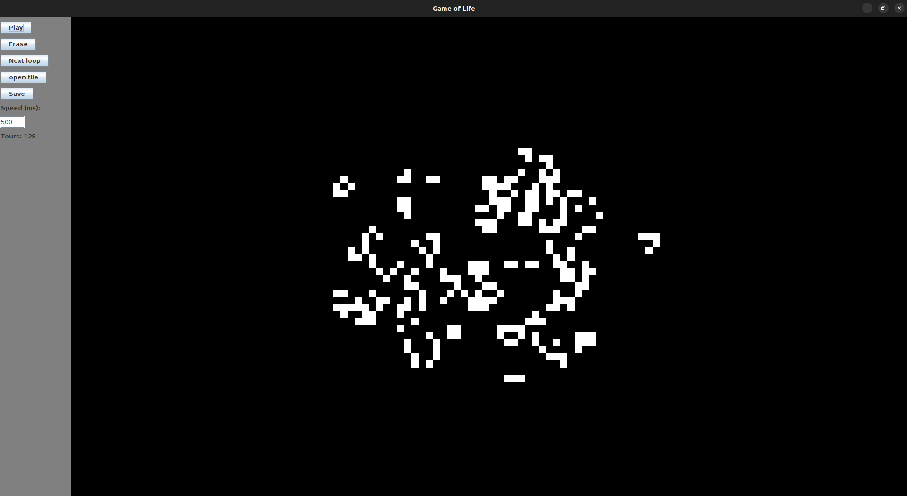

<div style="text-align: center;">

# 🌱 Game of Life in Java 🌱

</div>

## Description 📜
This project is an implementation of the famous "Game of Life" simulation by John Conway, coded in Java. The Game of Life is a cellular automaton that, despite its simple rules, can produce extremely complex and fascinating behaviors.

---

## Features ✨
- **Graphical Interface** 🎨: Uses Swing for an intuitive interface to visualize cell evolution.
- **Customizable Parameters** ⚙️: Modify grid size and simulation speed.
- **Interactive Controls** 🖱️: Add or remove cells using right-click.
- **Zoom and Pan** 🔍: Use mouse wheel to zoom and left-click drag to move the grid.
- **Save and Load** 💾: Save favorite configurations and load them from a file.
- **Simulation Controls** ⏯️: Start, pause, clear, and manually step through the simulation.

---

## Technologies Used 🛠️
- **Language**: Java ☕
- **Libraries**: Swing for graphical interface

---

## Getting Started 🚀

1. Clone the repository:
    ```bash
    git clone https://github.com/your-username/game-of-life-java.git
    ```
2. Import the project into your preferred IDE (Eclipse, IntelliJ, etc.).
3. Compile and run the program.

---

## Usage 🎮

- **Play/Pause** ▶️⏸️: Use the "Play" button to start the simulation and "Pause" to stop it.
- **Next loop** 🔄: Advance one step in the simulation without auto-playing.
- **Erase** 🗑️: Clear all current cells.
- **Open file** 📂: Load a cell configuration from a file.
- **Save** 💾: Save the current grid state to a file.
- **Zoom** 🔍: Use the mouse wheel to zoom in and out.
- **Grid Movement** 🖱️: Hold left-click and drag to move the grid.
- **Add/Remove Cells** ➕➖: Use right-click to add or remove cells on the grid.

---

## Preview 👀
<p align="center">
  
</p>

---

## About ℹ️
This project was developed to familiarize with Java and object-oriented programming concepts. It also serves as a foundation for exploring optimizations and advanced features.
